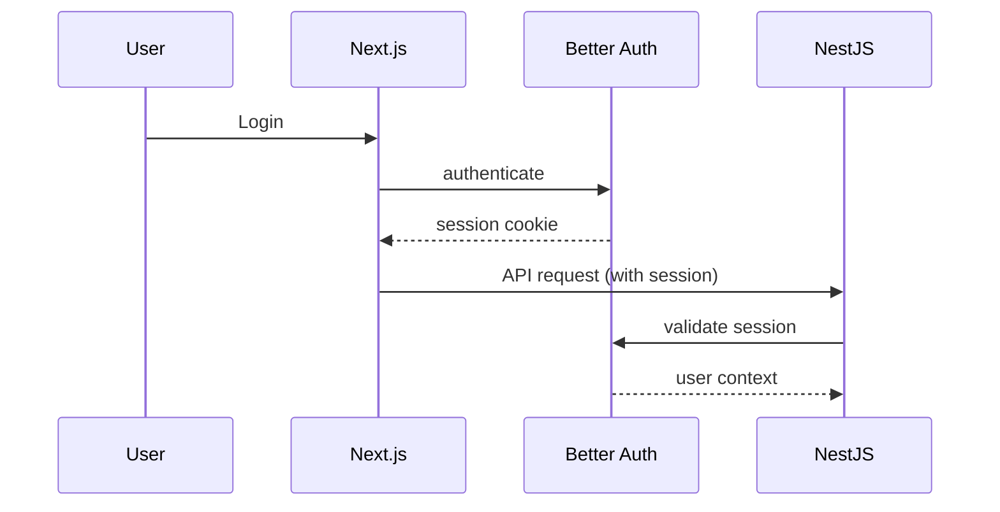

Understood. With **Next.js 16+ (App Router + Server Actions)** and **Better Auth**, the architecture shifts meaningfully—especially around auth, session handling, and the role of the BFF layer.

Below is the **updated architecture**, aligned with modern Next.js patterns.

---

# 1. Updated High-Level Architecture

```mermaid
flowchart LR
    A[Browser] --> B[Next.js 16 App (RSC + Server Actions)]
    B --> C[NestJS API]
    C --> D[(PostgreSQL)]
    C --> E[(Redis)]
    C --> F[Stripe Webhooks]

    subgraph Frontend
        A
        B
    end

    subgraph Backend
        C
        D
        E
        F
    end
```

---

# 2. Key Architectural Shift (Important)

## Before (older Next.js mindset)

- Client-heavy
- Custom auth handling
- API routes as proxy

## Now (Next.js 16 + Better Auth)

- **Server-first architecture (RSC)**
- **Auth handled via Better Auth (session-based)**
- **Server Actions replace most client mutations**
- Minimal need for custom BFF proxy

---

# 3. Auth Architecture (Better Auth)

## Core Model

- Session-based auth (not raw JWT in frontend)
- HTTP-only cookies
- Server-side session validation

## Flow



---

## Critical Decision

### Where to validate auth?

### Option A (recommended)

- Next.js validates session
- Pass **user context → NestJS**

### Option B

- NestJS validates session via Better Auth adapter

👉 For your project:
**Use Option A initially** (simpler, cleaner)

---

# 4. Request Flow (Updated)

## Fetch Issues (RSC)

```text
Server Component (Next.js)
→ getSession() via Better Auth
→ call NestJS API with user context
→ render on server
```

## Mutation (Server Action)

```text
<form action={createIssue}>
Server Action:
→ validate session
→ call NestJS
→ revalidatePath()
```

---

# 5. Updated Frontend Architecture (Next.js 16)

```bash
/apps/web
  /app
    /(auth)
      login/page.tsx
      register/page.tsx

    /(dashboard)
      layout.tsx
      page.tsx
      projects/
      issues/
        page.tsx
        [id]/page.tsx

  /features
    /issues
      actions.ts       # server actions
      queries.ts       # server-side fetchers
      components/

  /lib
    auth.ts            # Better Auth helpers
    api.ts             # fetch wrapper

  /components
  /styles
```

---

# 6. Server Actions Pattern (Important)

## Example: Create Issue

```ts
'use server'

import { getSession } from '@/lib/auth'
import { api } from '@/lib/api'

export async function createIssue(data: FormData) {
  const session = await getSession()

  if (!session) throw new Error('Unauthorized')

  await api.post('/issues', {
    title: data.get('title'),
    organizationId: session.orgId
  })
}
```

---

# 7. NestJS Adjustments for Better Auth

## You no longer rely on JWT parsing

Instead:

### Expect headers from Next.js:

```http
x-user-id
x-organization-id
x-user-role
```

## Create a guard:

```ts
@Injectable()
export class UserContextGuard implements CanActivate {
  canActivate(context: ExecutionContext) {
    const req = context.switchToHttp().getRequest()

    if (!req.headers['x-user-id']) {
      throw new UnauthorizedException()
    }

    return true
  }
}
```

---

# 8. Multi-Tenancy (Unchanged, but Enforcement Changes)

Still:

```sql
organization_id everywhere
```

But now enforced via:

- headers injected by Next.js
- not raw JWT decoding

---

# 9. API Client (Next.js)

## Server-side fetch wrapper

```ts
export async function apiFetch(path: string, options?: RequestInit) {
  const session = await getSession()

  return fetch(`${process.env.API_URL}${path}`, {
    ...options,
    headers: {
      'Content-Type': 'application/json',
      'x-user-id': session.user.id,
      'x-organization-id': session.orgId,
    },
  })
}
```

---

# 10. Caching Strategy (Next.js 16)

Use built-in:

## For queries

```ts
fetch(url, { cache: 'force-cache' })
```

## For dynamic data

```ts
fetch(url, { cache: 'no-store' })
```

## Revalidation

```ts
revalidatePath('/issues')
```

---

# 11. Where Next.js Replaces Complexity

You **do NOT need**:

- React Query (optional now)
- Client-side global state for server data
- Custom BFF routes

You **DO use**:

- Server Components
- Server Actions
- Native fetch caching

---

# 12. Stripe Integration (Same Backend Pattern)

Still handled in NestJS using Stripe

No change except:

- Next.js triggers checkout via Server Action
- NestJS handles webhooks

---

# 13. Optional Real-Time Layer

If you add it later:

```text
NestJS → WebSocket Gateway
Next.js → client subscription
```

Use for:

- issue updates
- comments
- presence

---

# 14. Deployment Architecture (Updated)

```mermaid
flowchart LR
    A[Vercel (Next.js 16)] --> B[NestJS API (Fly.io / Railway)]
    B --> C[PostgreSQL]
    B --> D[Redis]
```

---

# 15. Key Interview Talking Points (Updated Stack)

You should explicitly mention:

## Why Better Auth?

- secure session handling
- less custom auth code
- avoids JWT pitfalls

## Why Server Actions?

- reduces client complexity
- colocates logic with UI

## Why still NestJS?

- separation of concerns
- scalable backend
- handles webhooks, queues, RBAC

---

# 16. What This Signals

This stack shows:

- modern React architecture (RSC)
- understanding of backend boundaries
- awareness of auth best practices
- ability to avoid overengineering

---

# If You Want Next Step

I can now give you:

- **Better Auth setup (exact config)**
- **Prisma schema aligned with this architecture**
- **first 3 features implemented step-by-step (auth → org → issues)**

That would get you from architecture → working app quickly.
